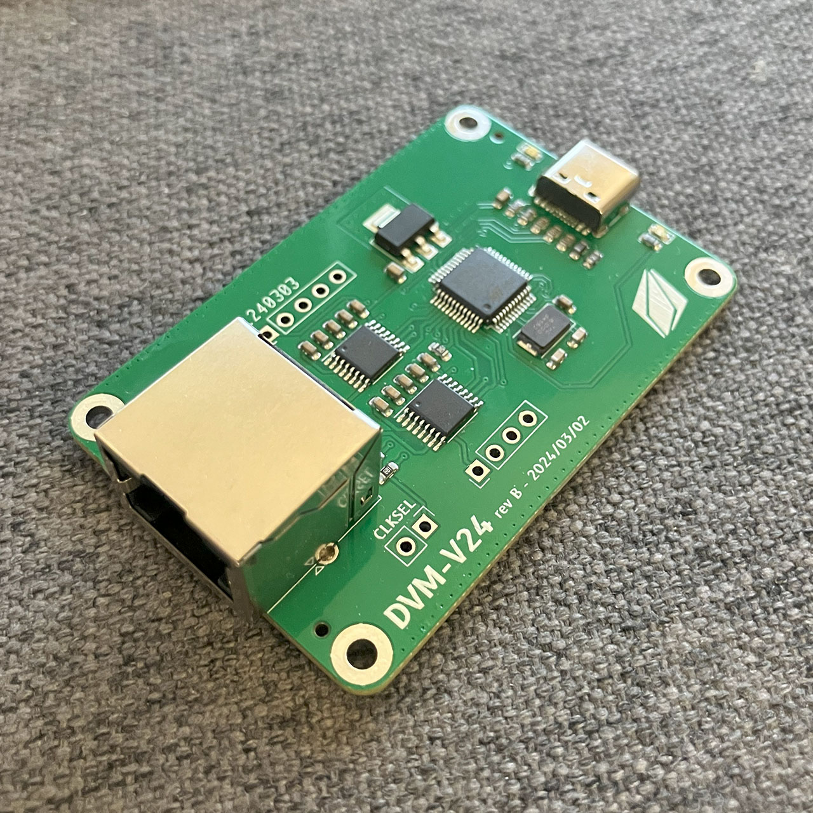
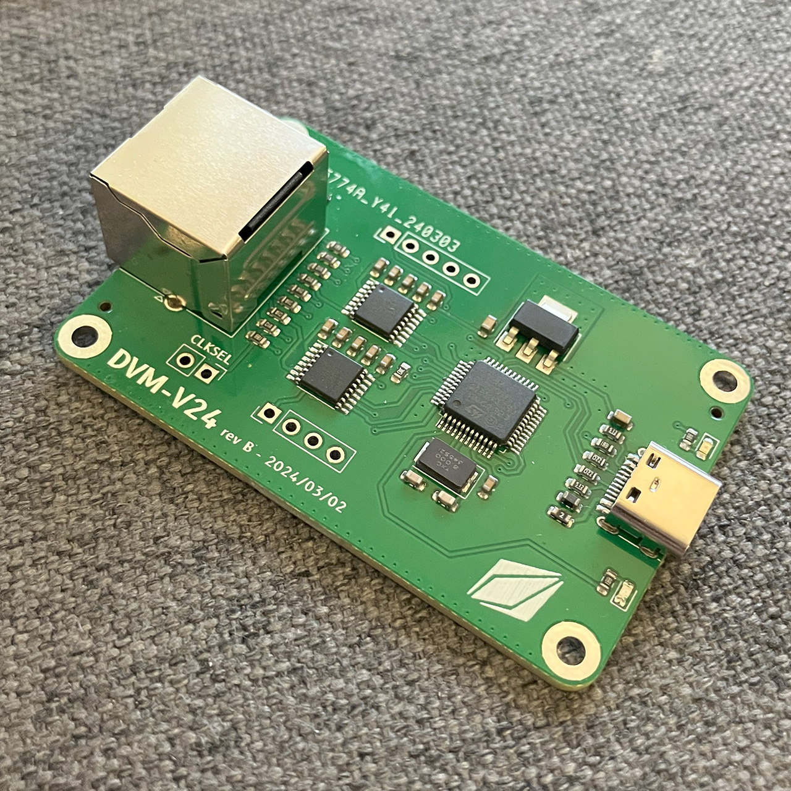
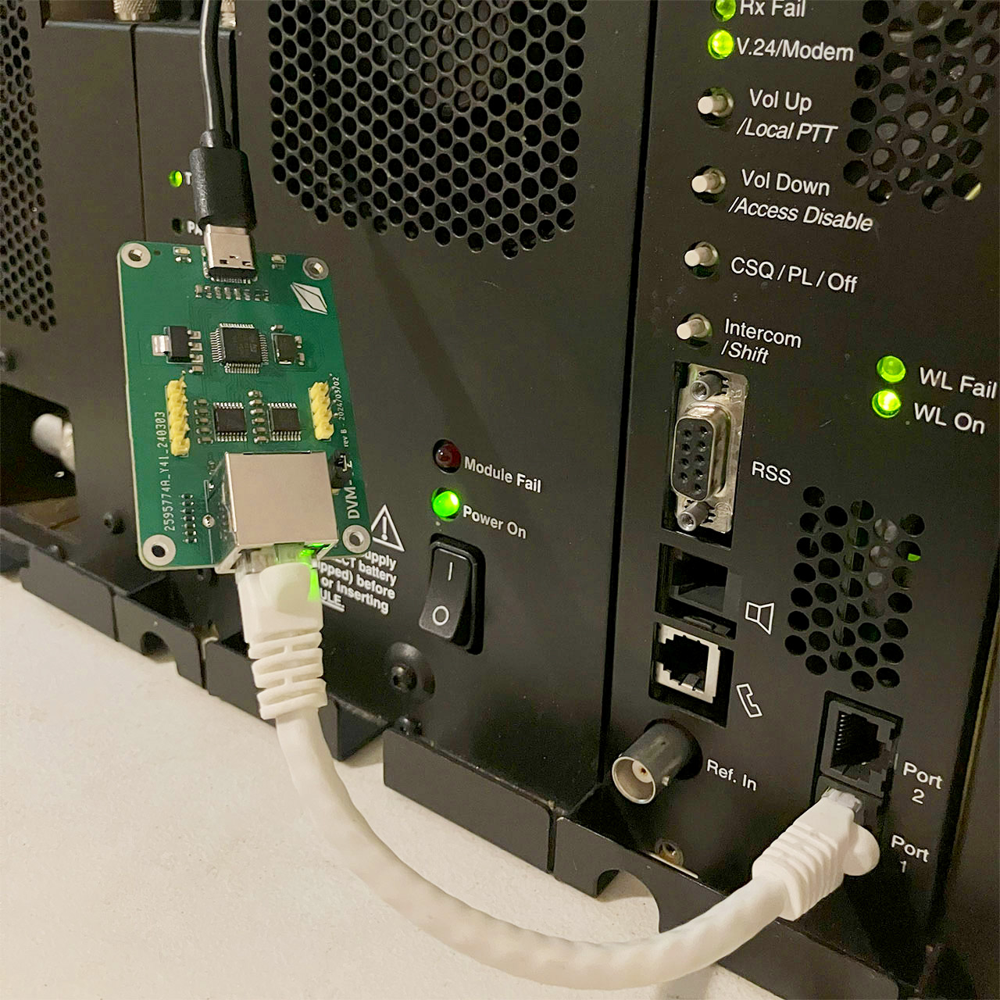
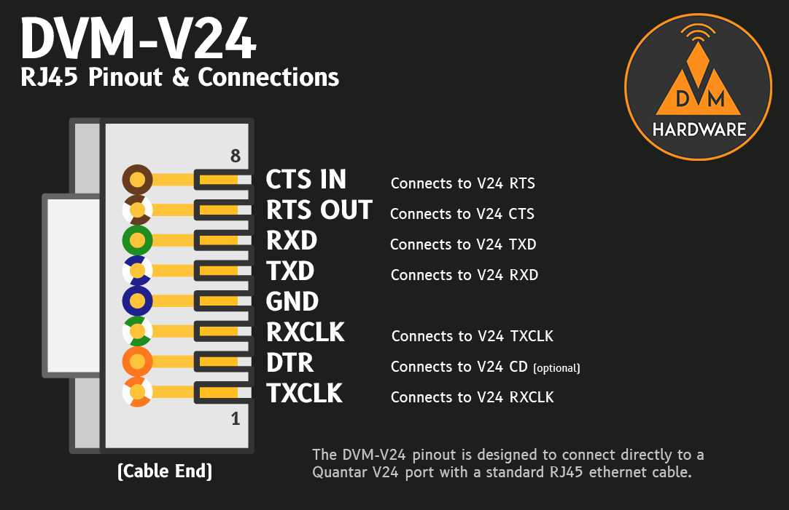

# DVM-V24 USB V24 Adapter
No more cisco routers and WIC cards! Now you can connect your quantar directly to a linked network without stacks of extra hardware. The DVM-V24 connects Quantars and other V24-capable equipment to the [DVM Host (dvmhost) software](https://github.com/DVMProject/dvmhost).



## Hardware
DVM-V24 boards are available from the [W3AXL Online Store](https://store.w3axl.com/products/dvm-v24-usb-converter-for-v24-equipment). Purchasing through W3AXL supports development efforts for the DVMProject team and future hardware projects!

Schematics for the board are also included in the `hw` directory to build your own adapters.

### Hardware Revisions

There are two hardware revisions, the original "V1" boards, and the newer "V2" boards. The V2 boards offload the USB->serial functionality to a dedicated CP2102 chip which alleviates some lockup/freezing issues that were encountered with the original V1 hardware.

The two hardware revisions require different firmware binaries, but both can be built from the same repository and commands.

### The `CLKSEL` Jumper

This jumper connects the serial clock line to the `RXCLK` pin. Currently this jumper must be in place for the V24 adapter to work properly. Version 1 boards require a jumper to be in place, while version 2 boards have the solder jumper shorted by default. In the future, the boards may support external clocking, but for now the firmware only supports generating clocks for both TX & RX.

### `UBT0` and `URST` Jumpers

These jumpers are specific to the version 2 boards and enable the RTS and DTR signals of the serial chip to force the board into UART bootloader mode. This will allow for programming using `stm32flash` even without access to the software boot command in `dvmhost`. By default these jumpers are **not** connected and must be bridged with solder to enable RTS/DTR boot control. Note that with these jumpers shorted, the V24 board will reset when `dvmhost` connects.

## Firmware
Firmware is availble in this repo, under the `fw` directory. It's written in bare C, generated from STM32CubeMX. You will need an STLink programmer in order to flash the boards with the latest version of software.

### Building the latest firmware
We recommend building the firmware for the DVM-V24 on a linux-based machine, since it's much easier to set up a working ARM toolchain.

On debian machines, you will need to install the following packages to build the fw:

```bash
sudo apt install gcc-arm-none-eabi cmake
```

Once you have the everything installed, perform the following steps to prepare the build environment:

```bash
mkdir build
cd build
cmake ..
```

Finally, you can build firmware individually for the v1 or v2 boards, or build both binaries:

```bash
# To build for V1 only:
make dvm-v24-v1
# or to build for V2:
make dvm-v24-v2
# make with no options will build both v1 and v2 binaries
make
```

### Flashing the firmware

#### Using STLink programmer

You may use the SWD headers on the board to load firmware via an STLink programmer. This is required for the V1 boards, and on the V2 boards if the firmware becomes corrupted and USB loading no longer works.

First make sure the stlink-tools are installed on your system:

```bash
sudo apt install stlink-tools
```

Then you can flash the board by using the following command
```bash
st-flash --reset write dvm-v24-xxx.bin 0x8000000
```

#### Using USB flashing

DVMV24-V2 boards can be loaded using the ST serial bootloader, in the same way that DVM modems can. First, you must put the board into bootloader mode using `dvmhost` in calibration mode:

```bash
./dvmhost -c <config file.yml> --cal
```

Then, enter bootloader mode using the `!` command. DVMHost will exit, and at this point you can use the stm32flash command:

```bash
stm32flash -v -w ./dvm-v24-v2.bin -R /dev/ttyUSBx
```

If you have the `UBT0` and `URST` jumpers shorted, you can also flash the board using DTR & RTS in a single command as follows:

```bash
stm32flash -v -w ./dvm-v24-v2.bin -i 'rts&-dtr:-rts&dtr' /dev/ttyUSBx
```

## Quick Start

### Quantar V24 Connection
The DVM-V24 RJ45 is pinned out so that a straight-through RJ45 cable (i.e. any normal, non-crossover ethernet cable) can be used to connect to the Quantar's front wireline RJ45 connectors.
#### Pinout


#### Repeater Programming
The following are the relevant fields that need to be configured in Quantar RSS:
|Field|Value  |
|--|--|
| Wireline Operation | 4 WIRE FULL DUPLEX |
| Astro To Wireline | ENABLED |
| Wireline Interface | V.24 ONLY |
| External Transmit Clock | ENABLED |
| RT/RT Configuration | DISABLED |

#### `dvmhost` Configuration
`dvmhost` must be configured to operate in dfsi mode. Under `modem`, ensure the following parameters are set:
```yaml
modem:
    protocol:
        type: "uart"
        mode: "dfsi"
        uart:
            port: /dev/ttyACM0 # change to your v24 board's serial port
            speed: 115200
    dfsi:
        rtrt: true
        diu: true
        jitter: 200
```

### CCGW V24 Connection
We are still investigating compatibility with the CCGW's V24 port. In theory, it should be possible, however early tests have shown the CCGW in Quantar compatibility mode does not properly mirror the Quantar's V24 port behavior.

## Support

Support is available on our Discord server - there are many users and project members online who can help with any issues you may encounter. [Join here!](https://discord.gg/3pBe8xgrEz)
